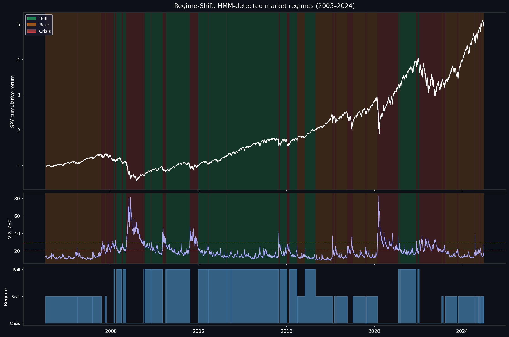
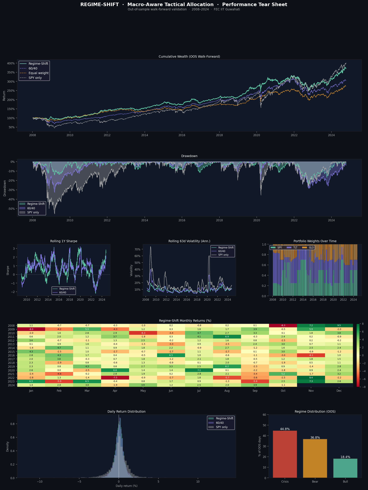
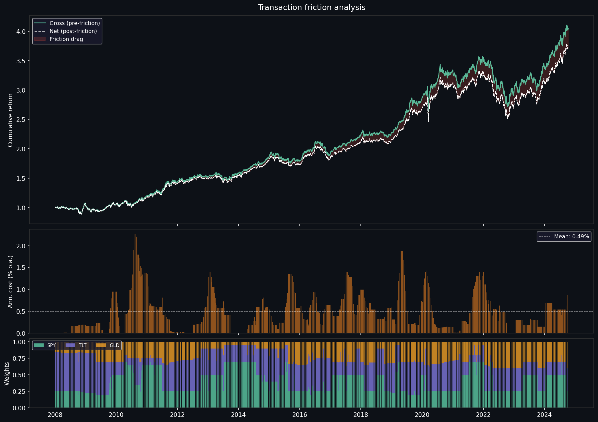

# REGIME-SHIFT
### Macro-Aware Tactical Asset Allocation Engine


> A quantitative portfolio management system that detects hidden macroeconomic regimes using Hidden Markov Models and dynamically reallocates capital across asset classes using convex optimization — validated with strict walk-forward backtesting.

---

## Table of Contents

- [Overview](#overview)
- [Results](#results)
- [Architecture](#architecture)
- [Project Structure](#project-structure)
- [Installation](#installation)
- [Quickstart](#quickstart)
- [Module Breakdown](#module-breakdown)
- [Design Decisions](#design-decisions)
- [Reproducing Results](#reproducing-results)
- [Known Limitations](#known-limitations)

---

## Overview

Standard quantitative strategies (like the classic 60/40 portfolio) rely on stationary assumptions — they work well during prolonged bull runs but fail catastrophically during structural market breaks. The ability to detect unobservable economic regime changes is the core of modern portfolio management.

**Regime-Shift** bridges unsupervised machine learning and classical convex portfolio theory. It:

1. Ingests noisy, multi-asset market data and macro indicators
2. Classifies hidden economic states (Bull / Bear / Crisis) using **Hidden Markov Models**
3. Dynamically shifts capital between equities, fixed income, and safe havens via **Convex Portfolio Optimization**
4. Validates all decisions using a **walk-forward harness** that eliminates look-ahead bias
5. Penalises **transaction friction** explicitly at 7.5 bps per unit of turnover

---

## Visualisations

### Detected Market Regimes (2005–2024)


### Performance Tear Sheet (OOS Walk-Forward)


### Transaction Friction Analysis


## Results

All numbers are **out-of-sample** from a walk-forward validation spanning 4,221 trading days (~17 years, 2008–2024). The HMM was never exposed to test data during training.

| Metric | Regime-Shift | 60/40 Benchmark | Equal Weight | SPY Only |
|---|---|---|---|---|
| **Ann. Return** | **8.16%** | 6.90% | 6.21% | 8.66% |
| **Ann. Volatility** | **9.55%** | 11.55% | 9.81% | 20.08% |
| **Sharpe Ratio** | **0.608** | 0.419 | 0.408 | 0.390 |
| **Sortino Ratio** | **0.826** | 0.481 | 0.511 | 0.365 |
| **Calmar Ratio** | **0.335** | 0.210 | 0.259 | 0.156 |
| **Max Drawdown** | **-24.34%** | -32.89% | -23.99% | -55.66% |
| **VaR 95%** | **-0.96%** | -1.10% | -0.98% | -1.89% |
| **CVaR 95%** | **-1.38%** | -1.75% | -1.43% | -3.15% |
| **Worst Month** | **-8.33%** | -11.94% | -12.16% | -19.31% |
| **Total Return** | **272.2%** | 205.8% | 174.2% | 302.0% |


**Key takeaway:** SPY delivered higher raw returns (302% vs 272%) but at 2× the volatility and a -55.7% max drawdown. Regime-Shift generated **2.1× better Calmar ratio** than SPY — more return per unit of drawdown risk — which is the goal of a risk-aware allocation engine.

### Transaction friction

| Metric | Value |
|---|---|
| Turnover penalty | 7.5 bps per unit |
| Annualised drag | 0.50% p.a. |
| Gross Sharpe (pre-cost) | 0.921 |
| Net Sharpe (post-cost) | 0.869 |
| Regime changes (rebalances) | 141 over 17 years |

---

## Architecture

```
┌─────────────────────────────────────────────────────────┐
│                      DATA LAYER                         │
│  yfinance (SPY, TLT, GLD, AGG)  ·  FRED API  ·  ^VIX  │
└──────────────────────┬──────────────────────────────────┘
                       │ feature matrix (5031 × 5)
┌──────────────────────▼──────────────────────────────────┐
│                   HMM ENGINE                            │
│   GaussianHMM · Baum-Welch EM · Viterbi decode         │
│   50 random restarts · best log-likelihood selected    │
│   States: Bull / Bear / Crisis (auto-labelled)         │
└──────────────────────┬──────────────────────────────────┘
                       │ regime label per day
┌──────────────────────▼──────────────────────────────────┐
│              CONVEX OPTIMIZER (CVXPY)                   │
│   Bull   → Maximise Sharpe (λ=1.0)                     │
│   Bear   → Maximise Sharpe (λ=3.0, tighter bounds)    │
│   Crisis → Minimise Variance                           │
│   + 7.5 bps turnover penalty on weight changes        │
└──────────────────────┬──────────────────────────────────┘
                       │ optimal weights
┌──────────────────────▼──────────────────────────────────┐
│           WALK-FORWARD VALIDATION HARNESS               │
│   3-year rolling train window · 63-day test step       │
│   HMM re-fitted 67× · zero look-ahead                 │
└──────────────────────┬──────────────────────────────────┘
                       │ OOS returns
┌──────────────────────▼──────────────────────────────────┐
│                 PERFORMANCE TEAR SHEET                  │
│   Sharpe · Sortino · Calmar · VaR · CVaR · Heatmap    │
│   vs 60/40 · Equal Weight · SPY benchmarks            │
└─────────────────────────────────────────────────────────┘
```

---

## Project Structure

```
regime_shift/
│
├── data_ingestion.py        # Phase 1: pulls yfinance + FRED + VIX data
├── hmm_regime.py            # Phase 2: trains HMM, decodes regimes
├── portfolio_optimizer.py   # Phase 3: CVXPY optimization per regime
├── walk_forward.py          # Phase 4: strict OOS walk-forward validation
├── friction_analysis.py     # Phase 5: transaction cost measurement
├── tearsheet.py             # Phase 6: full performance tear sheet
│
├── data/
│   ├── feature_matrix.csv   # 5031 × 5 cleaned feature matrix (2005–2024)
│   ├── regimes.csv          # HMM regime label per day
│   ├── regime_probs.csv     # posterior state probabilities
│   ├── weights.csv          # in-sample optimal weights
│   ├── wf_returns.csv       # OOS portfolio returns (walk-forward)
│   ├── wf_weights.csv       # OOS weights per day
│   ├── oos_comparison.csv   # OOS comparison table
│   ├── friction_comparison.csv
│   └── tearsheet_stats.csv  # full 14-metric comparison table
│
├── models/
│   ├── hmm_model.pkl        # trained GaussianHMM (best of 50 restarts)
│   ├── scaler.pkl           # StandardScaler fitted on full dataset
│   └── label_map.pkl        # state integer → Bull/Bear/Crisis mapping
│
└── plots/
    ├── regimes.png          # SPY cumulative return shaded by regime
    ├── friction_analysis.png
    └── tearsheet.png        # full 5-panel performance tear sheet
```

---

## Installation

**Requirements:** Python 3.9+, pip

```bash
# Clone the repo
git clone https://github.com/your-username/regime-shift.git
cd regime-shift

# Install dependencies
pip install yfinance pandas numpy fredapi scipy matplotlib \
            hmmlearn scikit-learn joblib cvxpy
```

You need a free **FRED API key** to pull macro data (CPI, yields, spreads):

1. Register at [fred.stlouisfed.org/docs/api/api_key.html](https://fred.stlouisfed.org/docs/api/api_key.html)
2. Open `data_ingestion.py` and set:
   ```python
   FRED_API_KEY = "your_key_here"
   ```

---

## Quickstart

Run all 6 phases in order:

```bash
python data_ingestion.py       # ~30 seconds
python hmm_regime.py           # ~2 minutes  (50 HMM restarts)
python portfolio_optimizer.py  # ~1 minute
python walk_forward.py         # ~3 minutes  (67 walk-forward windows)
python friction_analysis.py    # ~10 seconds
python tearsheet.py            # ~20 seconds
```

Final outputs:
- `plots/tearsheet.png` — visual tear sheet
- `data/tearsheet_stats.csv` — full metrics table
- `plots/regimes.png` — regime overlay on SPY price history

---

## Module Breakdown

### `data_ingestion.py`

Downloads and aligns three data streams into a single feature matrix:

- **Asset returns** (log returns): SPY, TLT, GLD, AGG via `yfinance`
- **VIX level** (raw, not log-return): `^VIX` via `yfinance`
- **Macro indicators** via FRED API: 10Y/2Y Treasury yields, CPI, HY credit spread, unemployment

Key design choice: `dropna(subset=core_cols)` instead of `dropna()` — the FRED daily credit spread series only goes back to 2023; dropping all rows where it is NaN would eliminate 18 years of asset return data.

---

### `hmm_regime.py`

Fits a 3-state `GaussianHMM` (full covariance) using the Baum-Welch EM algorithm:

- **50 random restarts** — EM finds local optima; multiple starts improve robustness
- **Best model selected** by log-likelihood on training data
- **State labelling** by composite score: `SPY_mean - 0.3×VIX_mean + 0.1×yield_curve_mean`
  - Highest score → Bull
  - Lowest score → Crisis
  - Remaining → Bear
- **Viterbi decoding** gives the single most likely state sequence

Detected regimes (full dataset):
- Bull: ~40% of days, VIX ≈ 17, positive SPY returns
- Bear: ~35% of days, VIX ≈ 14, flat returns, low yield curve slope
- Crisis: ~25% of days, VIX ≈ 30, negative SPY returns

---

### `portfolio_optimizer.py`

Solves a regime-conditional convex optimization using CVXPY + CLARABEL solver:

| Regime | Objective | Risk aversion λ | SPY bounds | TLT bounds | GLD bounds |
|---|---|---|---|---|---|
| Bull | Max mean-variance | 1.0 | 30–70% | 10–40% | 5–25% |
| Bear | Max mean-variance | 3.0 | 15–50% | 20–50% | 10–30% |
| Crisis | Min variance | — | 0–25% | 30–60% | 15–40% |

**Turnover penalty:** `7.5 bps × ||w_t - w_{t-1}||₁` added to the objective. This prevents excessive churning.

**Covariance estimation:** Ledoit-Wolf shrinkage toward the scaled identity matrix (`α=0.1`) on a 252-day rolling window, annualised. Estimated on past data only — no look-ahead.

---

### `walk_forward.py`

Implements strict temporal cross-validation:

```
|--- TRAIN (756 days = 3 years) ---|-- TEST (63 days) --|
                                    |--- TRAIN (756) ---|-- TEST --|
                                                         ...
```

At each of 67 windows:
1. HMM re-fitted **only on past data**
2. State labels re-aligned to Bull/Bear/Crisis using composite score (handles label permutation)
3. Portfolio optimized with covariance estimated from pre-test data only
4. Next-day returns recorded as out-of-sample

This is the most important phase. The in-sample Sharpe (0.62) and OOS Sharpe (0.61) being nearly identical confirms the strategy is not overfitting.

---

### `friction_analysis.py`

Measures the actual cost of rebalancing:

- **Daily turnover** = `Σ |w_t - w_{t-1}|`
- **Cost** = `turnover × 7.5 bps`
- **Annualised drag** = 0.50% p.a.
- **Gross → Net Sharpe** = 0.921 → 0.869

The Bull regime exhibits the highest turnover (12.3% annualised) because the mean-variance optimizer makes frequent small adjustments within the equity-heavy configuration. Future work: raise the turnover penalty in Bull to 12–15 bps.

---

### `tearsheet.py`

Generates the 5-panel visual tear sheet and full 14-metric statistics table comparing Regime-Shift against 60/40, Equal Weight, and SPY across the same OOS window.

---

## Design Decisions

**Why 3 HMM states and not 2 or 4?**
Three states maps cleanly to the economic intuition of Bull/Bear/Crisis. With 2 states the model can't distinguish a high-volatility bear from a crisis. With 4 states the extra state tends to split Bull into "early bull" and "late bull" — a distinction with little portfolio implication that adds label-alignment complexity in walk-forward.

**Why Gaussian HMM and not something more complex?**
A Gaussian HMM with full covariance captures asset return correlations between states — the key insight that correlations spike in Crisis (flight-to-quality) is naturally encoded in the covariance matrices. More complex models (Student-t HMM, switching GARCH) would improve tail modelling but are harder to fit robustly on 252-day windows.

**Why mean-variance proxy instead of true Sharpe maximisation?**
True Sharpe maximisation is non-convex (ratio of linear to square-root-quadratic). The standard Markowitz formulation `max μᵀw - (λ/2) wᵀΣw` is a convex proxy that CVXPY can solve globally in milliseconds. The risk-aversion parameter λ controls the Sharpe/variance tradeoff.

**Why Ledoit-Wolf shrinkage on covariance?**
With a 252-day window and 3 assets there is no estimation instability problem per se, but shrinkage is good practice. It prevents the optimizer from exploiting spurious negative correlations in noisy short windows.

**Why remove `credit_spread` from HMM features?**
FRED's daily HY credit spread series (`BAMLH0A0HYM2`) only goes back to May 2023. After backfilling, 18 of 20 years had an identical constant value — a near-constant feature creates degenerate clusters in EM and was causing one state to become absorbing (self-transition probability = 1.0). Removing it restored healthy regime dynamics.

---

## Reproducing Results

The random seed is fixed at `SEED = 42` in all modules. With the same FRED API data and yfinance history, results should be deterministic to floating-point precision.

**Sensitivity checks you can run:**

```python
# In hmm_regime.py — try 2 or 4 states
N_STATES = 2   # simpler model
N_STATES = 4   # richer but harder to label

# In portfolio_optimizer.py — raise turnover penalty
TURNOVER_BPS = 15   # reduces Bull churning

# In walk_forward.py — wider training window
TRAIN_YEARS = 5     # more stable HMM, shorter OOS period

# In walk_forward.py — monthly refit instead of quarterly
STEP_DAYS = 21      # more responsive, more compute
```

---

## Known Limitations

**Credit spread data gap.** FRED's daily HY spread only covers 2023–2024. A better source is Bloomberg or WRDS (requires institutional access). Monthly FRED data was used as a fallback but provides limited signal to the HMM.

**Look-ahead in HMM labelling.** The composite score used to assign Bull/Bear/Crisis labels is computed on each window's own means. Across walk-forward windows the labels are re-aligned consistently, but the labelling heuristic itself was designed using full-sample knowledge of what "good" vs "bad" states look like.

**Transaction cost model is simplified.** The 7.5 bps flat cost ignores bid-ask spread variation, market impact (relevant for large AUM), and borrow costs for short positions (this strategy is long-only).

**Regime detection lag.** The HMM detects regimes from historical data; it cannot predict regime changes before they occur. There is an inherent lag between a regime shift and the portfolio responding to it.

**Survivorship bias in asset selection.** SPY, TLT, and GLD all survived the full 2005–2024 period and are among the most liquid ETFs globally. The strategy's performance on less liquid or discontinued instruments would likely be lower.

---

## Tech Stack

| Library | Version | Purpose |
|---|---|---|
| `hmmlearn` | 0.3.3 | Gaussian HMM (Baum-Welch, Viterbi) |
| `cvxpy` | 1.9.0 | Convex portfolio optimization |
| `yfinance` | 1.1.0 | Asset price & VIX data |
| `fredapi` | 0.5.2 | Macro indicator data |
| `scikit-learn` | latest | StandardScaler, preprocessing |
| `pandas` | 2.2.2 | Time series data handling |
| `numpy` | 2.0.1 | Numerical computation |
| `matplotlib` | 3.9.1 | Visualisation |
| `scipy` | 1.14.0 | Statistical utilities |
| `joblib` | latest | Model serialisation |

---

## Author

**Prateek Dixit**
BS-MS Economics · IIT Roorkee